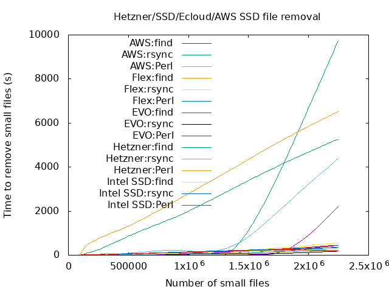
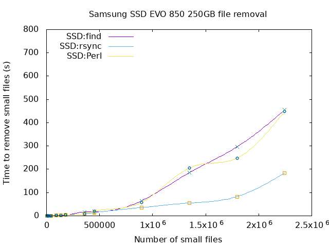

# Deleting large numbers of small files from a directory.

Comparison of methods used to delete thousands of small files from a directory on Linux filesystems

## Methods used

1. Rsync an empty directory:
      
        rsync_empty_dir.sh

2. find and delete using /bin/find command:

        find_delete.sh

3. Perl unlink method:

        unlink_perl.pl

## Usage

Run the tests and produces gnuplot compatible output

    doit.sh

This calls the underlying scripts after generating the necessary files. Performs a sync between each run.

Needs tidying up considerably as was written in a hurry to prove how wrong I was.

## Results

For the below graphs, the lowest value of y is preferential as it represents seconds to remove files.

### Comparing all platforms

Drilling down into the results which are less than 800 seconds:

### AWS t2-micro 100GB Provisioned SSD volume

Running doit.sh on the provisioned volume. Raw results are in AWS/

### ECloud Flex 100GB Provisioned SSD volume

Running doit.sh on the provisioned volume. Raw results are in FLEX/

### SSD Samsung EVO 850 250GB SSD.

Something very unusual happens here. find . -delete is slower and shows a non-exponential curve. Disk is used as the main operating system disk and this may have an impact on the tests. Treat with caution after reviewing the Intel results below.

### Intel 120GB SSDSC2BW120A4 SSD.

#### 1st run

Unusual tail off for rsync. This is due to the filesystem becoming full during the rsync and unlink_perl operations.Reviewing this find looks to be the best method here. 

#### Second run

Run to see what happens at 2 million files. It looks like the performance of Perl is better than find at this point. More investigation required.

### Hetzner 100GB SSD.

Running doit.sh on the provisioned volume. Raw results are in HETZNER/

