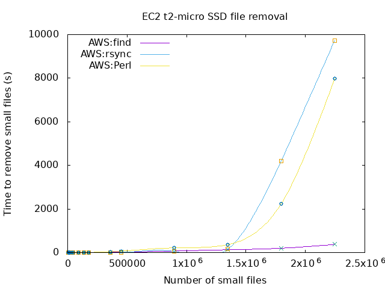

# delete_small_files_comparison

Comparison of methods used to delete thousands of small files from a directory on Linux filesystems

## Methods used

1. Rsync an empty directory:
      
        rsync_empty_dir.sh

2. find and delete using /bin/find command:

        find_delete.sh

3. Perl unlink method:

        unlink_perl.pl
## Usage
Run the tests and produces gnuplot compatible output

    doit.sh

This calls run_tests.sh which in turn calls the underlying scripts after generating the necessary files.

Needs tidying up considerably as was written in a hurry to prove how wrong I was.

